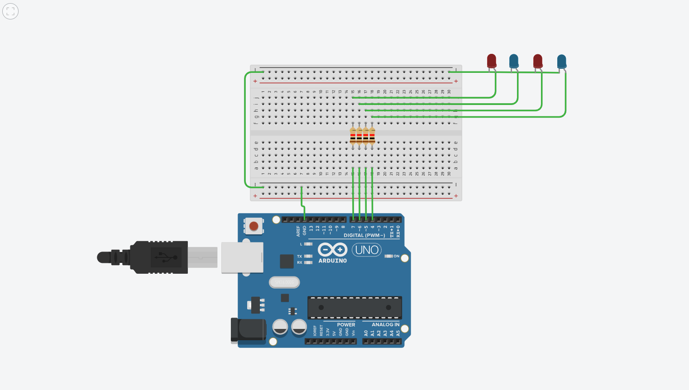
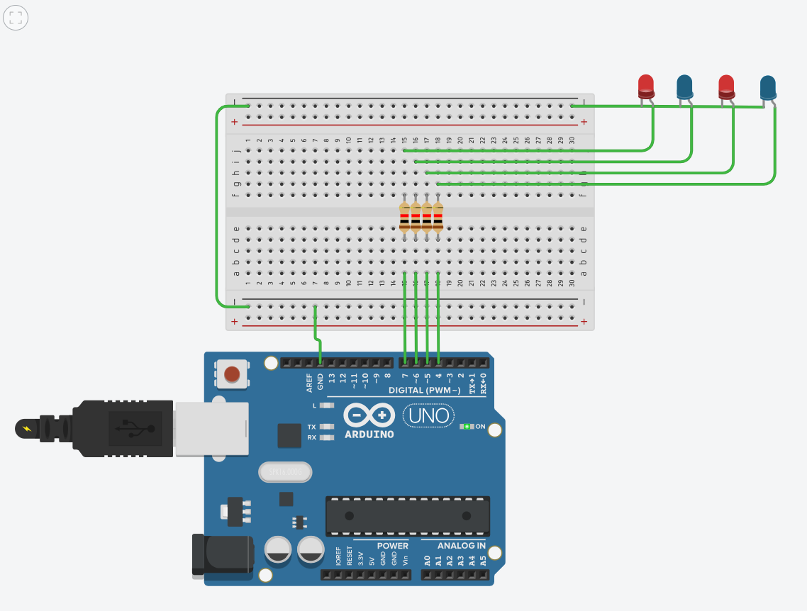
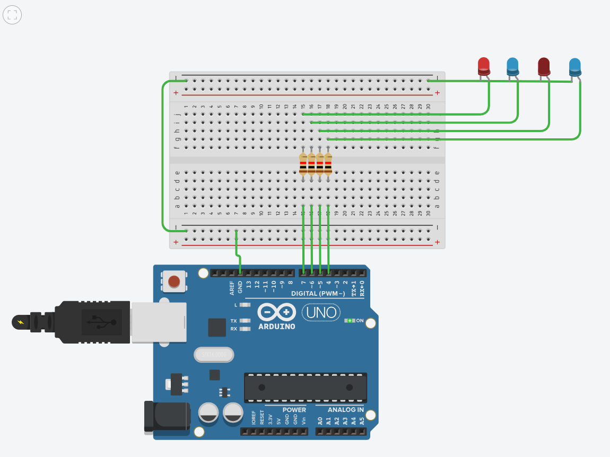

# Week 3 — Decimal to Binary Conversion Using LEDs

## 1. Aim

To design and simulate an Arduino circuit in Tinkercad that converts a decimal number into its 4-bit binary representation and displays it using four LEDs.

## 2. Components Used

* Arduino Uno
* Breadboard
* 4 LEDs
* 4 resistors
* Jumper wires

## 3. Circuit Connections

Four LEDs are connected to the Arduino Uno through resistors.

| LED   | Arduino Pin | Bit   |
| ----- | ----------- | ----- |
| LED 1 | 7           | MSB   |
| LED 2 | 6           | Bit 2 |
| LED 3 | 5           | Bit 3 |
| LED 4 | 4           | LSB   |

Each LED represents one binary bit. An LED turns ON for 1 and OFF for 0.

### Circuit Diagram

## 4. Working Principle

The program accepts a decimal number between 0 and 15 through the Serial Monitor.

The number is converted into binary by repeatedly dividing it by 2 and storing the remainders in an array. These remainders represent the binary bits.

The four bits are then displayed using the LEDs, starting from the most significant bit (MSB) to the least significant bit (LSB).

## 5. Arduino Program

The Arduino code is available in the file `code.ino`.

## 6. Testing and Output

### Test Case 1

**Input:** 10

**Binary Output:** 1010

**LED Status:** ON, OFF, ON, OFF

### Test Case 2

**Input:** 13

**Binary Output:** 1101

**LED Status:** ON, ON, OFF, ON

## 7. Result

The Arduino circuit was successfully designed and simulated in Tinkercad. The program converted decimal numbers into their corresponding 4-bit binary representations and displayed the results using four LEDs.

## 8. What I Learned

* How to control LEDs using Arduino digital pins.
* How to take input through the Serial Monitor.
* How to convert decimal numbers into binary using division and remainders.
* How to represent binary bits using LEDs.
* How to design and test circuits using Tinkercad.
