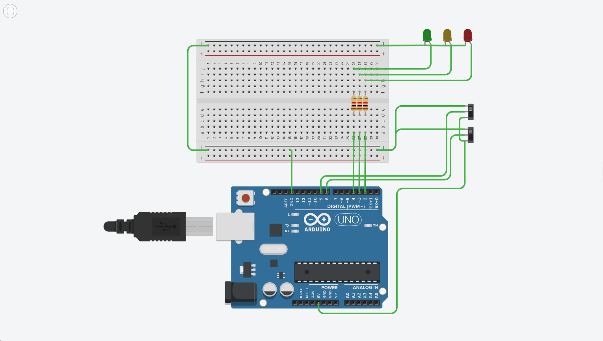

# Week 4 — Microcontrollers and Arduino Robot Control

## 1. Overview

This week focused on researching different microcontrollers, understanding how a potentiometer controls LED brightness, and implementing a robot movement control system using Arduino in Tinkercad.

# Part 1 — Research on Microcontrollers

## 2. Microcontrollers

A microcontroller is a compact integrated circuit containing a processor, memory, and input/output peripherals. It is used to control electronic devices and embedded systems.

### 2.1 Teensy 4.1

Teensy 4.1 is a high-performance microcontroller development board based on the ARM Cortex-M7 processor.

* Processor speed: 600 MHz
* Flash memory: 8 MB
* RAM: 1 MB
* Features: Multiple digital and PWM pins, analog inputs, USB host, and Ethernet support.
* Applications: Robotics, real-time control, audio processing, and advanced embedded systems.

### 2.2 ESP32

ESP32 is a microcontroller family commonly used in IoT and wireless communication projects.

* Processor: Depending on the model, single-core or dual-core.
* Wireless connectivity: Wi-Fi and Bluetooth are available on common ESP32 variants.
* Features: GPIO, ADC, PWM, and communication interfaces.
* Applications: Smart home systems, wireless sensors, IoT devices, and robotics.

### 2.3 Arduino UNO

Arduino UNO R3 is a popular development board used for learning electronics and embedded programming.

* Microcontroller: ATmega328P
* Clock speed: 16 MHz
* Digital I/O pins: 14
* Analog input pins: 6
* Features: Digital input/output, PWM, and serial communication.
* Applications: Beginner robotics, sensor interfacing, and automation projects.

### 2.4 Raspberry Pi Pico

Raspberry Pi Pico is a microcontroller board based on the RP2040 chip.

* Processor: Dual-core ARM Cortex-M0+
* Clock speed: Up to 133 MHz
* SRAM: 264 KB
* GPIO pins: 26 multifunction pins
* Features: PWM, ADC, SPI, I2C, and UART.
* Applications: Robotics, embedded systems, and electronic control projects.

# Part 2 — LED Brightness Using a Potentiometer

## 3. Working Principle

A potentiometer is a variable resistor that produces a changing voltage depending on its position.

When connected to an Arduino analog input, the Arduino reads the voltage using `analogRead()`. On the Arduino UNO, the reading ranges from 0 to 1023.

The value is then mapped to a PWM output range of 0 to 255 using the `map()` function. The `analogWrite()` function generates a PWM signal that controls the LED brightness.

* Low potentiometer value: LED brightness decreases.
* High potentiometer value: LED brightness increases.

PWM controls the average power delivered to the LED by switching it ON and OFF rapidly.

# Part 3 — Robot Movement Control Using Switches

## 4. Aim

To design and simulate an Arduino-based robot control system using two switches and three LEDs to indicate forward movement, backward movement, and stopped status.

## 5. Components Used

* Arduino UNO
* 2 switches
* 3 LEDs: Green, Yellow, and Red
* Resistors
* Breadboard
* Jumper wires
* Tinkercad Circuits

## 6. Problem Statement

The robot uses two switches to control its movement. The Arduino reads the state of both switches and controls three LEDs according to the required conditions.

The green LED indicates forward movement, the red LED indicates backward movement, and the yellow LED indicates that the robot is stopped.

## 7. Working Principle

The Arduino continuously reads the state of both switches and controls the LEDs based on their conditions.

| Switch 1 | Switch 2 | Green | Yellow | Red | Robot State |
| -------- | -------- | ----- | ------ | --- | ----------- |
| ON       | ON       | ON    | OFF    | OFF | Forward     |
| OFF      | ON       | OFF   | OFF    | ON  | Backward    |
| ON       | OFF      | OFF   | ON     | OFF | Stopped     |
| OFF      | OFF      | OFF   | ON     | OFF | Stopped     |

When both switches are ON, the robot moves forward. When the first switch is OFF and the second is ON, it moves backward. Whenever the second switch is OFF, the robot stops.

## 8. Circuit Diagram

The Arduino is connected to two switches and three LEDs. The switches act as inputs, while the LEDs act as outputs to indicate the robot's movement.

## 9. Arduino Program

The Arduino program reads both switch inputs and uses conditional statements to determine the robot's movement.

The corresponding LEDs are switched ON or OFF based on the input conditions.

The complete Arduino program is available in `code.ino`.

## 10. Testing and Output

The circuit was tested using different combinations of switch inputs.

The LEDs indicate the robot's movement according to the conditions specified in the problem statement.

Add screenshots of the circuit and its working output here.

## 11. Result

The robot control circuit was designed and simulated successfully in Tinkercad. The Arduino controlled the three LEDs according to the states of the two switches.

## 12. What I Learned

* Basic features and applications of different microcontrollers.
* How a potentiometer can control LED brightness using PWM.
* How to read digital inputs using Arduino.
* How to control multiple LEDs using conditional statements.
* How to design and simulate a simple robot control system in Tinkercad.
