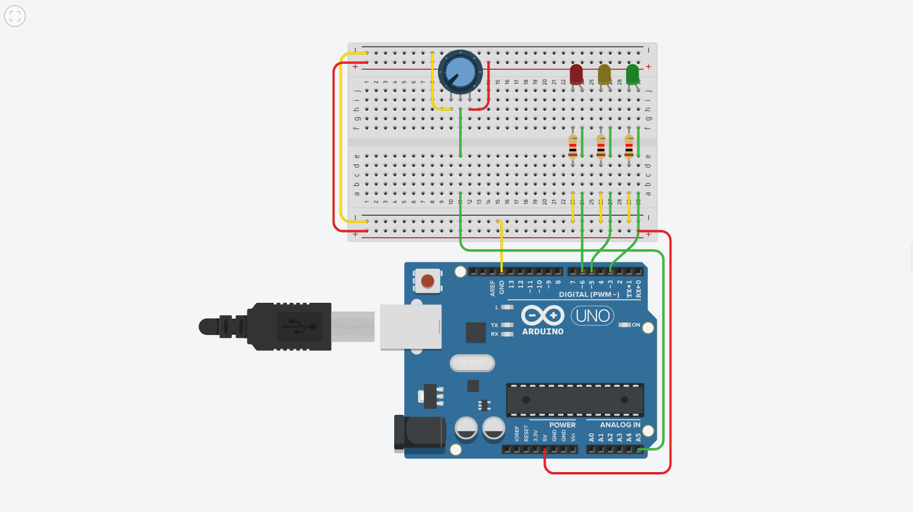
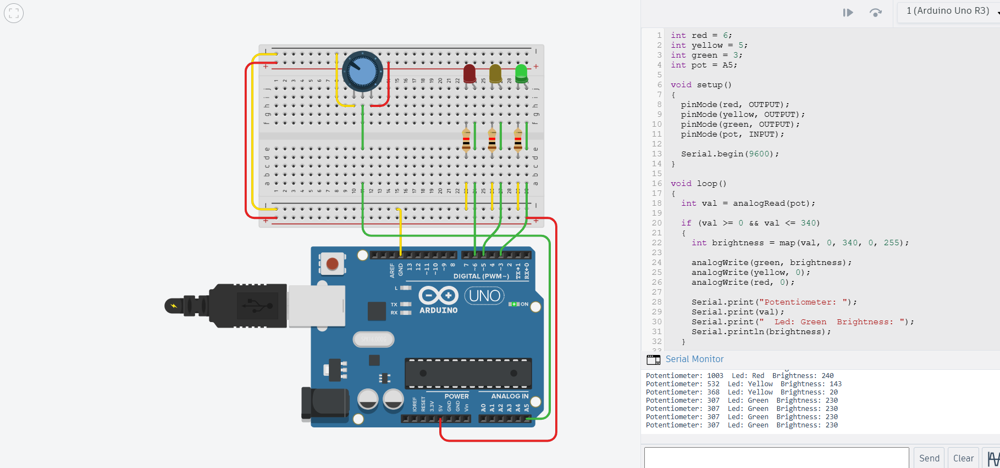

# Assignment 1 — LED Brightness Control Using Potentiometer

## 1. Aim

To control the brightness of three LEDs using a potentiometer and display the potentiometer value and current LED state on the Serial Monitor.

## 2. Components Used

- Arduino UNO
- Potentiometer
- 3 LEDs — Green, Yellow and Red
- Resistors
- Breadboard
- Jumper wires
- Tinkercad Circuits

## 3. Working Principle

The Arduino reads the potentiometer value using analogRead(), which gives a value between 0 and 1023.

Based on the value, one of the three LEDs is selected:

| Potentiometer Value |  LED   |
|---------------------|--------|
| 0–340               | Green  |
| 341–680             | Yellow |
| 681–1023            | Red    |

The brightness of the selected LED is controlled using PWM.

The potentiometer value and current LED state are displayed on the Serial Monitor.

## 4. Program Explanation

The program continuously reads the potentiometer value and checks which range it belongs to. The corresponding LED is turned ON and the other LEDs are turned OFF.

The potentiometer value is converted into a PWM value to control the brightness of the selected LED.

## 5. Circuit

## 6. Output

## 7. Result

The circuit was successfully implemented in Tinkercad. The potentiometer controlled the LED selection and brightness according to its value.