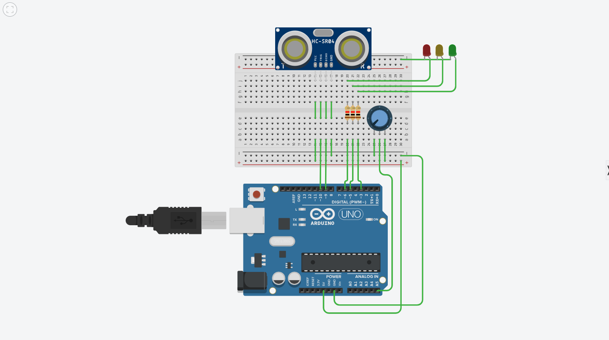
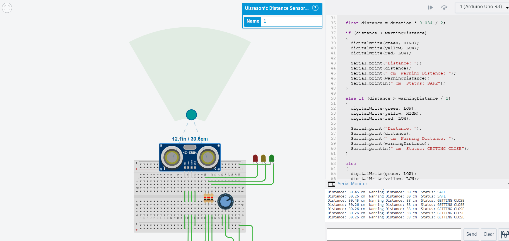

# Assignment 2 — Ultrasonic Warning System

## 1. Aim

To design an Arduino-based warning system using an ultrasonic sensor and potentiometer to detect obstacles and set the warning distance.

## 2. Components Used

- Arduino UNO
- HC-SR04 Ultrasonic Sensor
- Potentiometer
- 3 LEDs — Green, Yellow and Red
- Resistors
- Breadboard
- Jumper wires
- Tinkercad Circuits

## 3. Working Principle

The ultrasonic sensor measures the distance between the robot and an obstacle.

The potentiometer is used to set the warning distance between 10 cm and 50 cm.

The LEDs indicate the robot's status:

| Condition | LED | Status |
|---|---|---|
| Distance > Warning Distance | Green | Safe |
| Distance <= Warning Distance and > Half Warning Distance | Yellow | Getting Close |
| Distance <= Half Warning Distance | Red | Dangerously Close |

The measured distance, warning distance and current status are displayed on the Serial Monitor.

## 4. Program Explanation

The Arduino reads the ultrasonic sensor to calculate the distance of the obstacle. The potentiometer value is converted into a warning distance between 10 cm and 50 cm.

The measured distance is compared with the warning distance and half of the warning distance. Based on the result, the appropriate LED is turned ON.

## 5. Circuit

## 6. Output

## 7. Result

The warning system was successfully implemented in Tinkercad. The ultrasonic sensor detected obstacles and the LEDs indicated whether the robot was at a safe, warning or dangerous distance.