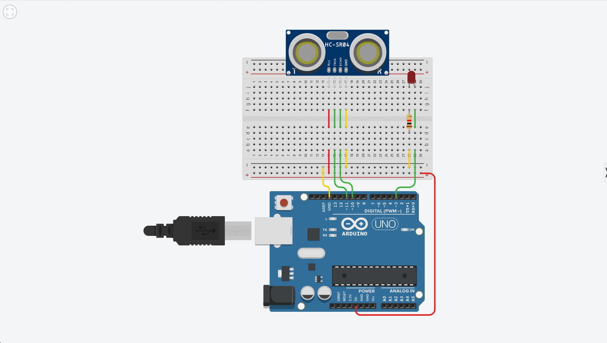
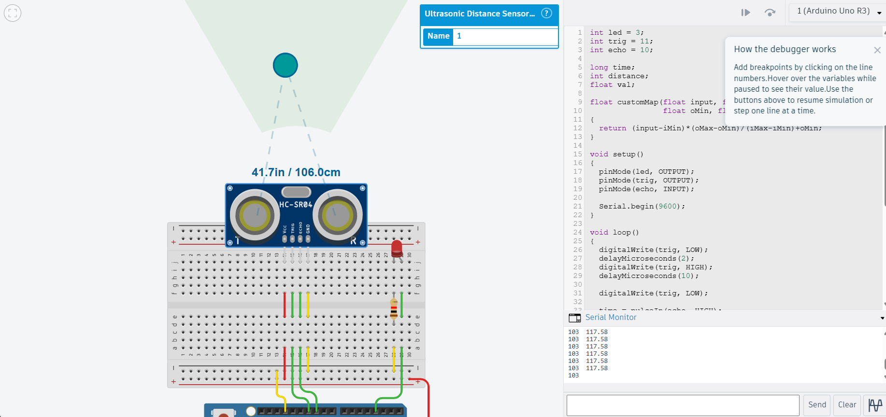

# Assignment 1 — Ultrasonic Sensor Based LED Brightness Control

## 1. Aim

To control the brightness of an LED using the distance measured by an HC-SR04 ultrasonic sensor.

## 2. Components Used

- Arduino UNO
- HC-SR04 Ultrasonic Sensor
- LED
- Resistor
- Breadboard
- Jumper wires

## 3. Working Principle

The HC-SR04 ultrasonic sensor is used to measure the distance of an object in centimeters.

The usable distance range is considered from 20 cm to 200 cm. The measured distance is converted into a PWM brightness value between 0 and 255.

| Distance | LED Brightness |
|----------|----------------|
| 20 cm    | 0              |
| 200 cm   | 255            |

As the object moves farther away from the sensor, the LED brightness increases proportionally.

Distances outside the 20–200 cm range are handled appropriately by the program.

## 4. Custom Map Function

A custom mapping function was created instead of using Arduino's built-in map() function.

The function has a FLOAT return type and converts the distance value from the range 20–200 cm to the PWM range 0–255.

The custom function is based on the mathematical mapping relationship between the input and output ranges.

## 5. Program Explanation

The Arduino continuously measures the distance using the ultrasonic sensor.

The measured distance is passed to the custom mapping function, which calculates the corresponding PWM brightness value. The calculated value is then sent to the LED using analogWrite().

This produces a proportional change in LED brightness as the distance changes.

## 6. Circuit

## 7. Output

The circuit was tested by changing the distance of the object from the ultrasonic sensor.

The LED brightness increased as the measured distance increased.

## 8. Result

The ultrasonic sensor based LED brightness control circuit was successfully implemented. The LED brightness changed proportionally with the measured distance using a self-written custom mapping function.