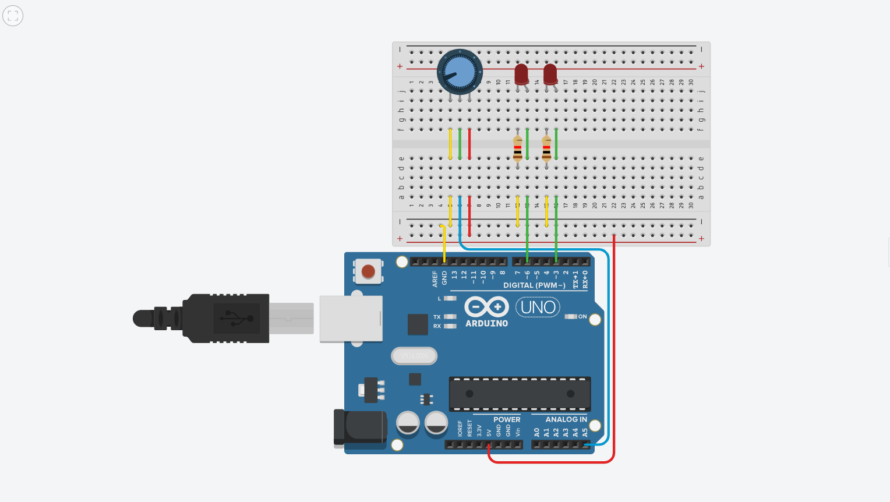
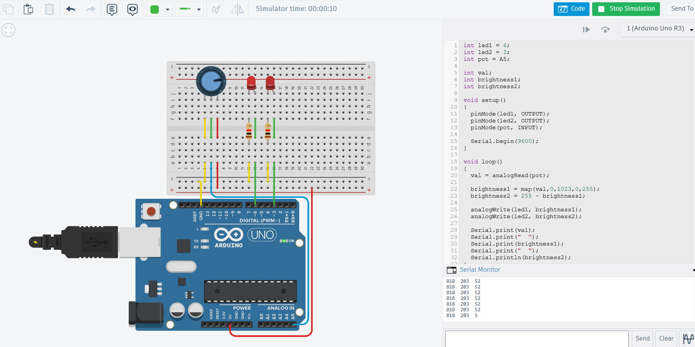

# Assignment 2 — Two LEDs With Potentiometer

## 1. Aim

To control the brightness of two LEDs using a potentiometer and PWM.

## 2. Components Used

- Arduino UNO
- Potentiometer
- 2 LEDs
- 2 Resistors
- Breadboard
- Jumper wires

## 3. Working Principle

The potentiometer is connected to an analog input of the Arduino. Its value is read using analogRead() and produces a value between 0 and 1023.

The two LEDs are connected to PWM pins.

The brightness of the LEDs changes in opposite directions:

| Potentiometer | LED 1                | LED 2                |
|---------------|----------------------|----------------------|
| Low           | OFF / Low brightness | High brightness      |
| High          | High brightness      | OFF / Low brightness |

As the potentiometer is turned up, the brightness of LED 1 increases while the brightness of LED 2 decreases.

## 4. Program Explanation

The Arduino reads the potentiometer value and converts it into a PWM value.

The PWM value is used for LED 1, while the corresponding inverse value is used for LED 2. Therefore, increasing the potentiometer value increases the brightness of LED 1 and decreases the brightness of LED 2.

## 5. Circuit

## 6. Output

The circuit was tested by varying the potentiometer position.

At a low potentiometer value, LED 1 had low brightness while LED 2 had high brightness. At a high potentiometer value, LED 1 had high brightness while LED 2 had low brightness.

## 7. Result

The two-LED brightness control circuit was successfully implemented using a potentiometer and PWM. The LEDs changed brightness in opposite directions according to the potentiometer value.