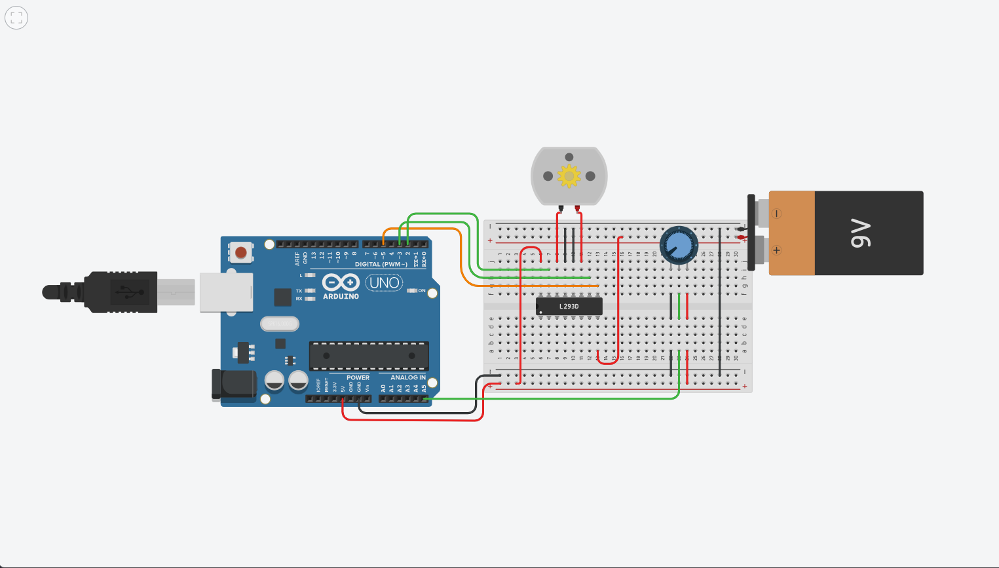
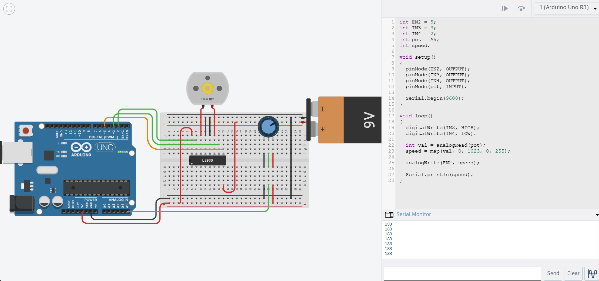

# Week 7 — DC Motor Speed Control Using Potentiometer

## 1. Aim

To control the speed of a DC motor using a potentiometer and an L293D motor driver in Tinkercad.

## 2. Components Used

- Arduino UNO
- L293D Motor Driver IC
- DC Motor
- Potentiometer
- Breadboard
- Jumper wires

## 3. Working Principle

The potentiometer is connected to an analog input of the Arduino. Its value is read using analogRead(), which produces a value between 0 and 1023.

The potentiometer value is mapped to the PWM range of 0 to 255. This PWM value is applied to the enable pin of the L293D motor driver to control the motor speed.

| Potentiometer Value | Motor Speed       |
|---------------------|-------------------|
| Minimum             | 0%                |
| Middle              | Approximately 50% |
| Maximum             | 100%              |

The direction of the motor is controlled using the IN3 and IN4 pins of the L293D.

## 4. Program Explanation

The Arduino reads the potentiometer value continuously and converts it from the range 0–1023 to the PWM range 0–255 using the map() function.

The resulting PWM value is sent to the EN2 pin of the L293D using analogWrite(). As the potentiometer value increases, the PWM value increases and the motor speed increases.

The calculated PWM value is also displayed on the Serial Monitor.

## 5. Circuit

## 6. Arduino Program

The complete Arduino program is available in `code.ino`.

## 7. Output

The circuit was tested by varying the potentiometer value.

At the minimum potentiometer value, the motor stopped. As the potentiometer was increased, the motor speed increased. At the maximum value, the motor ran at maximum speed.

## 8. Result

The DC motor speed control circuit was successfully implemented in Tinkercad. The potentiometer was used to control the motor speed from 0% to 100% using PWM and an L293D motor driver.